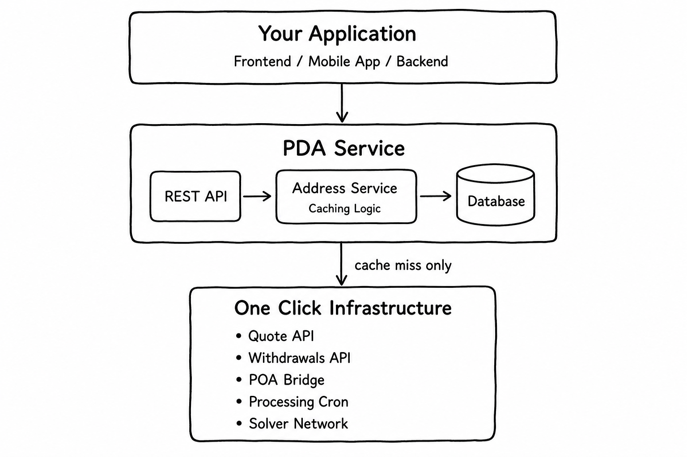
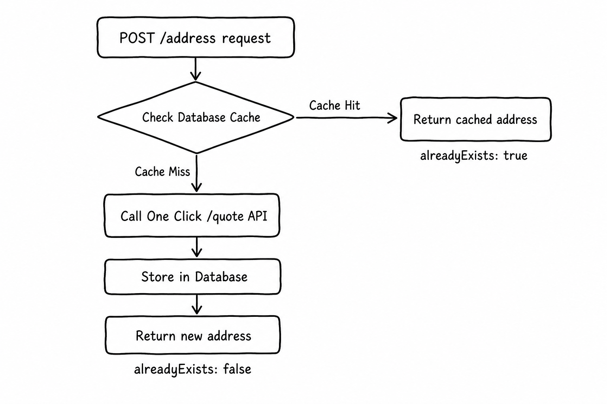
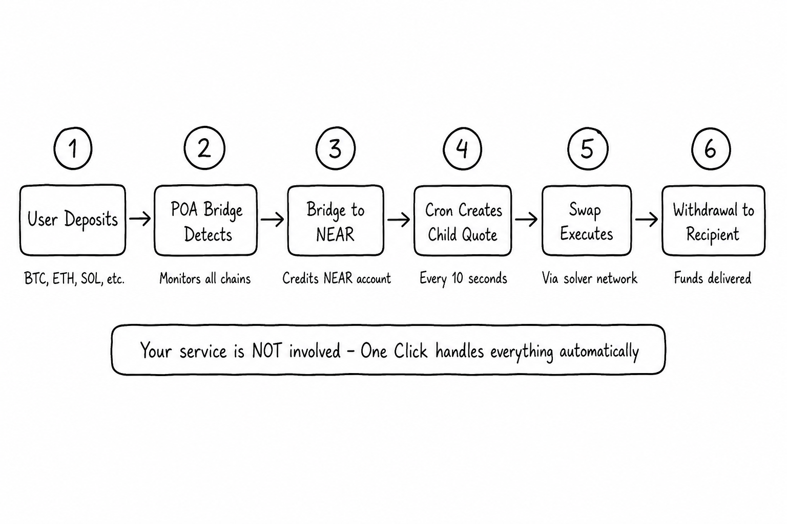
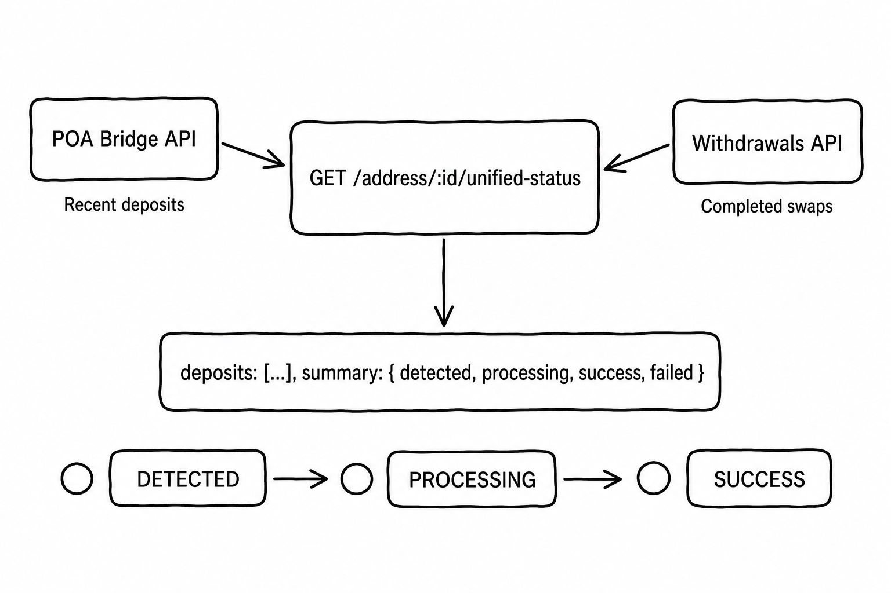

# Persistent Deposit Address Service Guide


 This repository serves as a **guide** for building a re-usable deposit addresses service wrapper aroubd One Click API's ANY_INPUT mechanism. This service is to be used as an intro into the architecture to understand the architecture, so that it can be adapted it for your production environment.

---

## Architecture

This reference implementation is minimal ny design and only scopes the core design principles. Your service should only need to handle caching and API exposure. Then One Click handles everything else such deposit detection, swap execution, and withdrawal to the final recipient and so on etc



### Core Components

The project is organized into focused services, each with a single responsibility:

| Service | File | Responsibility |
| --- | --- | --- |
| REST API | `src/address/address.controller.ts` | Exposes endpoints for creating addresses and querying status |
| Address Service | `src/address/address.service.ts` | Implements caching logic, chain normalization, idempotency |
| One Click Client | `src/one-click/one-click.service.ts` | HTTP client for One Click Quote and Status APIs |
| Database Entity | `src/address/address.entity.ts` | TypeORM entity defining the address cache schema |

### How to Think About Each Layer

**Your Application** should call th re-usable address service when a user needs a deposit address. For example, this could be a frontend requesting an address to display, or a backend provisioning addresses for new users.

**The Re-usable Address Service** itself is just simply the the caching and idempotency layer. Its only job is to ensure the same inputs always return the same address. It should do  this by:
- Checking your database for an existing address matching the request parameters
- On cache miss, call the One Click API to create a new ANY_INPUT quote
- Store the returned address in your database
- Returning the address (cached or new) to your application
 
**The One Click Infrastructure** handles everything after the address is created:
- Monitors all supported chains for incoming deposits (via POA Bridge)
- Detects when funds arrive at the deposit address
- Creates child quotes to swap deposited tokens to the destination asset
- Executes swaps via the solver network
- Withdraws funds to the recipient on the destination chain

### This Service as a Foundation

This reference implementation uses SQLite and NestJS for simplicity. For production, you should:

- Replace SQLite with PostgreSQL or your preferred database
- Add authentication and rate limiting to protect your endpoints (only applies if you choose not to make interal service)
- Integrate with your existing user management system
- Add monitoring, logging, and alerting
- Consider a distributed lock (Redis) for high-concurrency scenarios

Howeevr the core logic for the likes of caching, the One-Click call and the storeing of the address result — remains the same regardless of your tech stack.

---

## Address creation

The Address Service (`src/address/address.service.ts`) manages the core caching logic. The flow is straightforward: check the cache first, call One Click only on miss.



In this tes example each address request contains the following parameters Butg note that the parameters choosen can be up to personal preferecne as long as gthey yeild a deterministic output. For example in this service chain to chain routes are determinisitc not every unique asset:

```typescript
interface CreateAddressRequest {
  userId: string;          
  depositChain: string;  
  destinationChain: string;
  destinationAsset: string;
  recipient: string;       
  refundTo?: string;        
  appFees?: AppFee[];      
}
```

The re usable address service handles each incoming request by:

1. **Normalizing the chain** — all EVM chains map to `evm` since they share one deposit address
2. **Checking the cache** — looks up existing address by unique key
3. **Calling One Click** — on cache miss, creates an ANY_INPUT quote
4. **Storing the result** — saves the address with a unique constraint for idempotency

---

## Chain normalization

Its worth highlightig the concept of chain normalisation since there is some pre-requisitie knoweldgae here. So since All EVM chains share the same deposit address, the service should normalizes them before lookup. This ensures that requesting an address for "arb" and later for "eth" returns the same cached address.

```typescript
const EVM_CHAIN_ALIASES = new Set([
  'evm', 'eth', 'ethereum', 'arb', 'arbitrum', 'base', 
  'bsc', 'bnb', 'op', 'optimism', 'pol', 'polygon', 
  'avax', 'avalanche', 'gnosis'
]);

private normalizeDepositChain(rawDepositChain: string) {
  const normalized = rawDepositChain.trim().toLowerCase();
  return EVM_CHAIN_ALIASES.has(normalized) ? 'evm' : normalized;
}
```

The unique constraint in the database uses the normalized chain:

```typescript
@Unique('UQ_user_chain_asset', ['userId', 'depositChain', 'destinationAsset'])
```

This guarantees idempotency in the sense that the same inputs always return the same address.

---

## Calling One Click

When the cache misses, the One Click Service (`src/one-click/one-click.service.ts`) creates an ANY_INPUT quote. This quote type accepts any token at any amount, with a far-future deadline.

```typescript
async createAnyInputQuote(request: CreateAnyInputQuoteRequest): Promise<OneClickQuoteResponse> {
  const payload = {
    dry: false,
    depositMode: 'SIMPLE',
    swapType: 'ANY_INPUT',
    originAsset: '1cs_v1:any',           // Accept any token
    depositType: 'INTENTS',
    destinationAsset: request.destinationAsset,
    recipient: request.recipient,
    recipientType: 'DESTINATION_CHAIN',
    refundTo: request.refundTo ?? request.recipient,
    refundType: 'INTENTS',
    deadline: getQuoteDeadlineIso(10),   // 10 years
    slippageTolerance: 0.01,
    amount: '0',
    confidentiality: 'public',
    appFees: request.appFees ?? [],
  };

  const response = await this.http.post(`${this.apiUrl}/v0/quote`, payload);
  return this.normalizeQuoteResponse(response.data);
}
```

The response includes deposit addresses for all supported chains:

```typescript
interface OneClickQuoteResponse {
  accountId: string;  // NEAR account ID
  quote: {
    depositAddress: string;
    chainDepositAddresses: {
      eth: string;    // Shared by all EVM chains
      arb: string;
      base: string;
      btc: string;    // Unique per non-EVM chain
      sol: string;
      tron: string;
      // ...
    };
  };
}
```

> **Note:** One Click generates a unique address for every request (the derivation includes timestamps). This is why caching is required so you cannot fully rely on One Click to return the same address for identical inputs.

---

## Deposit processing

Once an address exists, then thats pretty much it and your service's job is pretty uch done. One Click handles the entire deposit lifecycle automatically — your service is not involved in any of these steps.



The processing happens in six stages:

1. **User deposits** — sends funds to the deposit address on any supported chain
2. **Bridge detects** — POA Bridge monitors all chains for incoming transfers
3. **Bridge to NEAR** — funds are bridged and credited to the NEAR account
4. **Cron creates child quote** — every 10 seconds, One Click checks for new balances
5. **Swap executes** — a child EXACT_INPUT quote swaps to the destination asset
6. **Withdrawal** — funds are bridged to the recipient on the destination chain

The 10-second cron interval means deposits typically process within 1-5 minutes, depending on the source chain's confirmation time.

---

## Status tracking

While deposit processing is automatic, you'll want to show users the status of their deposits. The challenge is that status information is split across two APIs — the POA Bridge knows about detected deposits, and the Withdrawals API knows about completed swaps.

The controller (`src/address/address.controller.ts`) provides a unified status endpoint that merges both sources into a single response.



```typescript
@Get('address/:id/unified-status')
async getUnifiedStatus(@Param('id') id: number): Promise<UnifiedStatusResponse> {
  const address = await this.addressService.findById(id);

  // Query both APIs in parallel
  const [bridgeResult, withdrawalsResult] = await Promise.allSettled([
    this.oneClickService.getRecentDeposits(address.accountId),
    this.oneClickService.getWithdrawals(address.accountId),
  ]);

  // Merge into unified view
  const deposits = this.mergeDeposits(bridgeRes.deposits, withdrawalsRes.withdrawals);
  
  return { address, deposits, summary: this.getSummary(deposits) };
}
```

The unified response tracks each deposit through its lifecycle:

```typescript
interface UnifiedDeposit {
  status: 'DETECTED' | 'PROCESSING' | 'SUCCESS' | 'FAILED';
  depositTxHash: string;
  withdrawTxHash?: string;
  chain: string;
  amountIn: string;
  amountOut?: string;
  detectedAt: string;
  completedAt?: string;
}
```

| Status | Meaning |
| --- | --- |
| `DETECTED` | Deposit seen on chain, waiting for bridge |
| `PROCESSING` | Bridged to NEAR, swap in progress |
| `SUCCESS` | Completed, funds sent to recipient |
| `FAILED` | Failed (will auto-retry on next cron tick) |

---

## API Reference

### Create or get address

```bash
POST /address
Content-Type: application/json

{
  "userId": "user-123",
  "depositChain": "btc",
  "destinationChain": "base",
  "destinationAsset": "nep141:base-0xa0b86991c6218b36c1d19d4a2e9eb0ce3606eb48.omft.near",
  "recipient": "0x742d35Cc6634C0532925a3b844Bc9e7595f2bD12"
}
```


The `alreadyExists` field indicates whether this was a cache hit (`true`) or a new address (`false`).

### Get unified status

```bash
GET /address/<USERID>/unified-status
```


### List all addresses

```bash
GET /addresses/all?limit=10&offset=0
```

---

## Quick Start

### Prerequisites

- Node.js 24+
- pnpm

### Install dependencies

```bash
# Clone the repository
git clone https://github.com/defuse-protocol/pda-reference-service.git
cd pda-reference-service

# Install all dependencies (backend + UI)
pnpm install
```

### Configure environment

```bash
cp .env.example .env
# Edit .env with your settings
```

| Variable | Default | Description |
| --- | --- | --- |
| `PORT` | 3100 | Server port |
| `ONE_CLICK_API_URL` | Production URL | One Click API endpoint |
| `DATABASE_PATH` | ./pda.sqlite | SQLite database file |
| `DEFAULT_SLIPPAGE_TOLERANCE` | 100 | Slippage in basis points (1%) |

### Run the service

```bash
# Run API only
pnpm start

# Run UI only
pnpm ui

# Run both API and UI together
pnpm dev
```

- API: `http://localhost:3100`
- UI: `http://localhost:3101`

### Test address creation

```bash
curl -X POST http://localhost:3100/address \
  -H "Content-Type: application/json" \
  -d '{
    "userId": "test-user-1",
    "depositChain": "btc",
    "destinationChain": "base",
    "destinationAsset": "nep141:base-0xa0b86991c6218b36c1d19d4a2e9eb0ce3606eb48.omft.near",
    "recipient": "0x742d35Cc6634C0532925a3b844Bc9e7595f2bD12"
  }'
```

---

## Production considerations

The reference implementation uses SQLite for simplicity. For production:

- **Replace SQLite** with PostgreSQL for better concurrency
- **Add authentication** to your API endpoints
- **Add rate limiting** to prevent abuse
- **Monitor cache hit rate** — should be >90% for reusable addresses
- **Set up alerting** for stuck deposits or API errors

### Handling race conditions

The unique constraint handles concurrent requests for the same address:

```typescript
try {
  const quote = await this.oneClickService.createAnyInputQuote(request);
  return await this.saveAddress(request, quote);
} catch (error) {
  if (this.isUniqueViolation(error)) {
    // Another request won the race — return their result
    return await this.repo.findOne({ where: whereClause });
  }
  throw error;
}
```

For high-traffic scenarios, consider adding a distributed lock (Redis) before the One Click call.

---

## Testing the Full Flow

Once the service is running, follow these steps to test the complete deposit lifecycle.

### Step 1: Create a deposit address

Generate a new address for receiving ETH deposits and converting to USDC on Base:

```bash
curl -X POST http://localhost:3100/address \
  -H "Content-Type: application/json" \
  -d '{
    "userId": "demo-user-1",
    "depositChain": "eth",
    "destinationChain": "base",
    "destinationAsset": "nep141:base-0xa0b86991c6218b36c1d19d4a2e9eb0ce3606eb48.omft.near",
    "recipient": "0x742d35Cc6634C0532925a3b844Bc9e7595f2bD12"
  }'
```

Response:

```json
{
  "id": 1,
  "userId": "demo-user-1",
  "depositChain": "evm",
  "destinationChain": "base",
  "destinationAsset": "nep141:base-0xa0b86991c6218b36c1d19d4a2e9eb0ce3606eb48.omft.near",
  "recipient": "0x742d35Cc6634C0532925a3b844Bc9e7595f2bD12",
  "depositAddress": "0x1a2b3c4d5e6f7890abcdef1234567890abcdef12",
  "accountId": "abc123def456789...",
  "alreadyExists": false,
  "chainDepositAddresses": {
    "eth": "0x1a2b3c4d5e6f7890abcdef1234567890abcdef12",
    "arb": "0x1a2b3c4d5e6f7890abcdef1234567890abcdef12",
    "base": "0x1a2b3c4d5e6f7890abcdef1234567890abcdef12",
    "btc": "bc1qxy2kgdygjrsqtzq2n0yrf2493p83kkfjhx0wlh",
    "sol": "7xKXtg2CW87d97TXJSDpbD5jBkheTqA83TZRuJosgAsU"
  },
  "createdAt": "2026-07-05T15:00:00.000Z"
}
```

Note the `depositAddress` — this is what you show to the user. Since we requested `eth`, we get an EVM address that works on Ethereum, Arbitrum, Base, and all other EVM chains.

### Step 2: Make a deposit

Send funds to the deposit address on any supported chain. For EVM chains:

1. Open your wallet (MetaMask, etc.)
2. Send ETH, USDT, USDC, or any supported token to the `depositAddress`
3. Use any EVM network (Ethereum, Arbitrum, Base, etc.) — they all share the same address

For testing with small amounts, Arbitrum or Base have lower gas fees.

> **Note:** After sending, the deposit will be detected by the POA Bridge within a few minutes (depending on block confirmations). One Click will automatically swap to USDC and send to your recipient address.

### Step 3: Poll the unified status

Check the status of deposits for your address:

```bash
curl http://localhost:3100/address/1/unified-status
```

Response while processing:

```json
{
  "address": {
    "id": 1,
    "userId": "demo-user-1",
    "depositAddress": "0x1a2b3c4d5e6f7890abcdef1234567890abcdef12",
    "depositCount": 1,
    "lastDepositAt": "2026-07-05T15:05:00.000Z"
  },
  "deposits": [
    {
      "status": "PROCESSING",
      "depositTxHash": "0xabc123...",
      "chain": "eth",
      "amountIn": "100000000000000000",
      "amountInFormatted": "0.1",
      "detectedAt": "2026-07-05T15:05:00.000Z"
    }
  ],
  "summary": {
    "detected": 0,
    "processing": 1,
    "success": 0,
    "failed": 0,
    "total": 1
  }
}
```

Response after completion:

```json
{
  "address": { ... },
  "deposits": [
    {
      "status": "SUCCESS",
      "depositTxHash": "0xabc123...",
      "withdrawTxHash": "0xdef456...",
      "chain": "eth",
      "amountIn": "100000000000000000",
      "amountInFormatted": "0.1",
      "amountOut": "250000000",
      "amountOutUsd": "250.00",
      "detectedAt": "2026-07-05T15:05:00.000Z",
      "completedAt": "2026-07-05T15:08:00.000Z"
    }
  ],
  "summary": {
    "detected": 0,
    "processing": 0,
    "success": 1,
    "failed": 0,
    "total": 1
  }
}
```

### Step 4: Verify idempotency

Request the same address again — it should return from cache:

```bash
curl -X POST http://localhost:3100/address \
  -H "Content-Type: application/json" \
  -d '{
    "userId": "demo-user-1",
    "depositChain": "arb",
    "destinationChain": "base",
    "destinationAsset": "nep141:base-0xa0b86991c6218b36c1d19d4a2e9eb0ce3606eb48.omft.near",
    "recipient": "0x742d35Cc6634C0532925a3b844Bc9e7595f2bD12"
  }'
```

Note we changed `depositChain` from `eth` to `arb`, but since both normalize to `evm`, you'll get the same address with `"alreadyExists": true`.

---

## Dashboard UI

The service includes a React dashboard for visualizing addresses and monitoring deposit statuses in real-time.

### Features

- **Address list** — view all created addresses with their routes and deposit counts
- **Status badges** — color-coded indicators for DETECTED (yellow), PROCESSING (orange), SUCCESS (green), FAILED (red)
- **Auto-polling** — configurable refresh interval (2s, 5s, 10s, 30s)
- **Create address form** — quick form with presets for common routes
- **Deposit details** — click any address to see its deposit history and transaction hashes

### Setup

```bash
# Install all dependencies
pnpm install

# Run both API and UI
pnpm dev
```

This starts:
- API on `http://localhost:3100`
- UI on `http://localhost:3101`

Or run them separately:

```bash
pnpm start  # API only
pnpm ui     # UI only
```

**3. Open the dashboard:**

Navigate to [http://localhost:3101](http://localhost:3101) in your browser.

### Using the Dashboard

**Create an address:**
1. Fill in the form on the right side
2. Select deposit chain, destination chain, and asset
3. Enter your recipient address
4. Click "Create Address"

**Monitor deposits:**
1. Created addresses appear in the table
2. Click an address row to see its deposit details
3. Status updates automatically based on poll interval
4. Use the dropdown to adjust polling frequency

**View deposit history:**
1. Select an address from the table
2. The right panel shows all deposits for that address
3. Each deposit shows: status, amounts, transaction hashes, timestamps

### Configuration

The UI proxies API requests to the backend. This is configured in `ui/vite.config.ts`:

```typescript
server: {
  port: 3101,
  proxy: {
    '/api': {
      target: 'http://localhost:3100',
      changeOrigin: true,
      rewrite: (path) => path.replace(/^\/api/, ''),
    },
  },
}
```
